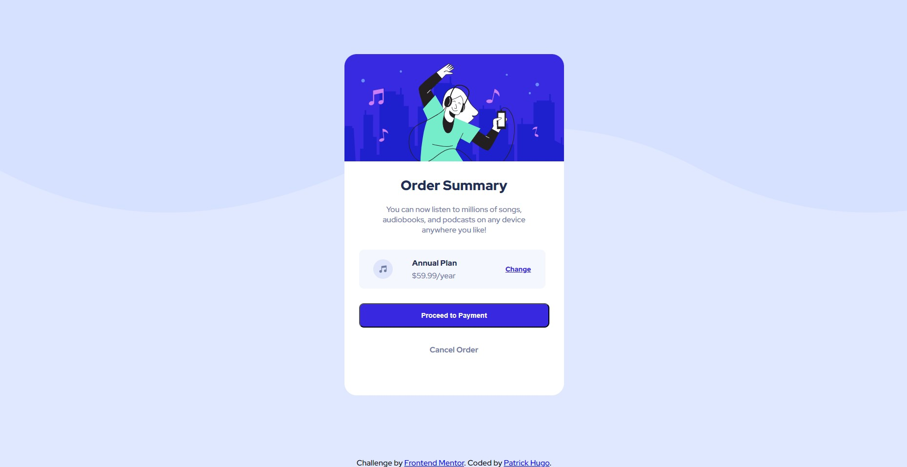

# Frontend Mentor - Order-summary-component

This is a solution to the [Order-summary-component challenge on Frontend Mentor](https://www.frontendmentor.io/challenges/order-summary-component-QlPmajDUj). Frontend Mentor challenges help you improve your coding skills by building realistic projects. 

## Table of contents

- [Overview](#overview)
  - [The challenge](#the-challenge)
  - [Screenshot](#screenshot)
  - [Links](#links)
- [My process](#my-process)
  - [Built with](#built-with)

### The challenge

Users should be able to:

- View the optimal layout depending on their device's screen size

### Screenshot

### Links

- Solution URL: https://github.com/patrickhsa/Order-summary-component
- Live Site URL: https://patrickhsa.github.io/Order-summary-component/

## My process

### Built with

- Semantic HTML5 markup
- CSS custom properties
- Flexbox

